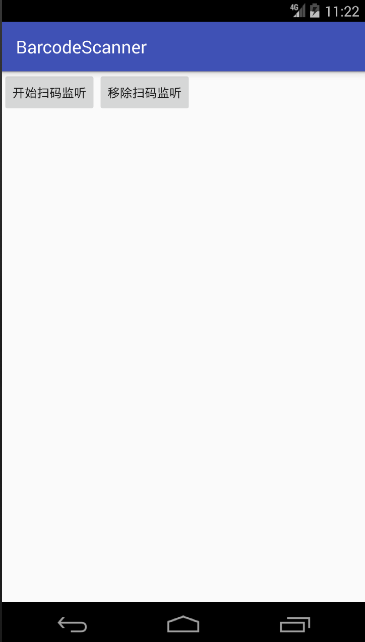

## 扫码枪扫码功能（扫商品条码，支付条码等）

因为扫码枪就相当于外部输入设备（和键盘一样），所以就是监听按键输入事件（或者按键回调事件），然后获取这些输入的字符，最后拼接在一起就是一个完整的条码

## 两种思路：
1. 在 Activity 中的 dispatchKeyEvent()/onKeyDown() 回调事件中，捕获按键事件KeyEvent
2. 使用无障碍服务AccessibilityService，在后台实现按键监听，也是onKeyEvent() 回调方法中 （有使用条件）

## BarcodeScannerResolver（扫码枪事件解析类）
使用说明：
  * 在Activity中先创建BarcodeScannerResolver对象，并设置扫码成功监听器: setScanSuccessListener() [一般在onCreate()方法中初始化]
  * 接着在Activity#dispatchKeyEvent() 或者 Activity#onKeyDown() 中调用本类中的resolveKeyEvent()方法。当扫码结束之后，会自动回调第一步设置的监听器中的方法

原理分析：
1. 扫码枪就是一个外部的输入设备（和键盘一样）。扫码的时候，就是在极短的时间内输入了一系列的数字或字母
2. 这样就可以在键盘事件中抓捕这些输入的字符，但是又会产生一个问题（快速扫两次的情形）：在键盘事件中应该抓捕多少个字符呢？即一个条码应该在哪个位置结束呢？ （有的扫码枪会以一个回车或者换行作为一次扫码的结束符，但是有的就纯粹的是一系列的条码。这个得需要设置）

所以为了兼容性，应当是当短时间内不再输入字符的时候，就表示扫码已结束。这样只能定性描述，不能定量，只能自己在程序中用一个具体的数字来表示这个“短时间”，eg:500ms。（如果每个条码结束的时候都有一个结束符那该多好，直接判断这个结束符，就可以知道当前扫码已完成）
接下来就产生了BarcodeScannerResolver这个类。

核心原理就一句话：在Activity的键盘监听事件中，每抓捕到一个字符的时候，就先向 Handler 一次一个runnable对象，再延迟500ms发送一个runnable. 这样若两个输入字符的间隔时间超过了500ms，则视为两次扫码

## 后台无障碍服务AccessibilityService（也是Service的一种）实现按键监听的功能：
可以一直在后台运行，监听按键功能。

* 对于扫码输入监听，使用 AccessibilityService 则有点大材小用了。因为我们的扫码功能只在特定的某些页面才有，所以只需要在这些Activity中的按键事件的回调方法中捕获输入的字符即可。
* 而无障碍服务 AccessibilityService 来实现按键监听，则一般用于机顶盒或者智能电视，也就是AndroidTv。针对遥控器某些特殊按键，实现按键的监听，并实现相应的功能。 当然 AccessibilityService 的功能很强大，远不止按键监听这一项。

参考：http://blog.csdn.net/w815878564/article/details/53331086

启动：AccessibilityService 的方法：（要注意：用户应用的话，下面这种方式是启动不了的，只用系统级的应用才可以用下面这种方式启动。若系统是自己开发的话，可以直接把签名应用(要和系统的签名是一样的)放到/system/framework/目录下即可成为系统级应用）
用户级应用只用这样启动：设置 --> 辅助功能 --> 选择服务进行开启/关闭

    //代码启动AccessibilityService（只适用于系统级应用）
    private void startKeyEventService(){
        //注意 这里可能为空（也就是如果当前没有任何一个无障碍服务被授权的时候 就为空了 ）
        String enabledServicesSetting = Settings.Secure.getString(getContentResolver(), Settings.Secure.ENABLED_ACCESSIBILITY_SERVICES);

        ComponentName selfComponentName = new ComponentName(getPackageName(), "com.ronda.barcodescanner.KeyEventService");
        String flattenToString = selfComponentName.flattenToString();
        if (enabledServicesSetting == null || !enabledServicesSetting.contains(flattenToString)) {
            enabledServicesSetting += flattenToString;
        }
        Settings.Secure.putString(getContentResolver(), Settings.Secure.ENABLED_ACCESSIBILITY_SERVICES, enabledServicesSetting);
        Settings.Secure.putInt(getContentResolver(), Settings.Secure.ACCESSIBILITY_ENABLED, 1);
    }

使用 AccessibilityService 的要点：
* AndroidManifest.xml 中的声明（除了android:name属性，其他都是固定的写法）

        <service
            android:name=".KeyEventService"
            android:enabled="true"
            android:exported="true"
            android:permission="android.permission.BIND_ACCESSIBILITY_SERVICE">
            <intent-filter>
                <action android:name="android.accessibilityservice.AccessibilityService"/>
            </intent-filter>
            <meta-data
                android:name="android.accessibilityservice"
                android:resource="@xml/accessibilityservice"/>
        </service>

* accessibilityservice.xml 的写法（基本形式如下）

        <?xml version="1.0" encoding="utf-8"?>
        <accessibility-service
            xmlns:android="http://schemas.android.com/apk/res/android"
            android:accessibilityEventTypes="typeAllMask"
            android:accessibilityFeedbackType="feedbackGeneric"
            android:accessibilityFlags="flagRequestFilterKeyEvents"
            android:canRequestFilterKeyEvents="true"
            android:canRetrieveWindowContent="true"
            android:description="@string/service_name"
            android:packageNames="com.ronda.barcodescanner"
            >
        </accessibility-service>

